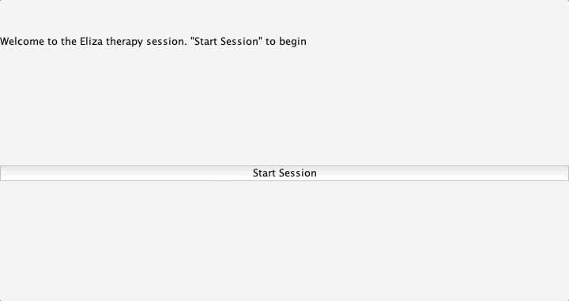

#  
# Eliza 

### User Stories

In 1996 there was a program named ELIZA.
It parodied a psychotherapist session, such that the user would type sentences and the program used those words to compose a question. This applet is similar in concept.

### Minimum Viable Product

A JFrame with a JPanel containing the following...
* jlabel for displaying the program questions
* jtextfield for the user's response to be typed
* jbutton to allow the user to submit the answer
* jlabel for displaying all the (longestWords) he/she used in this session
* jbutton for the user to request all (longestWords) used in this session

### Technologies used

* **Java** To build the user interface and control its behavior
* **Swing** To make use of components exclusive to Swing

### Installation Instructions
1. Run `npm install` within the `app` folder
2. Run `npm start` within the `app` folder